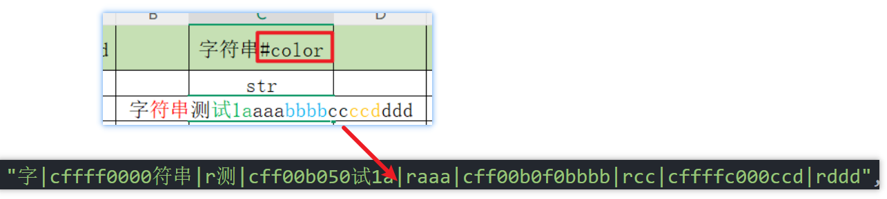
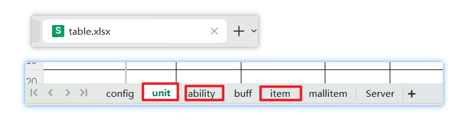
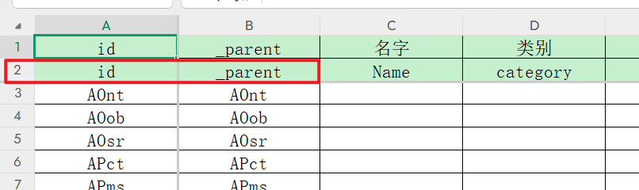
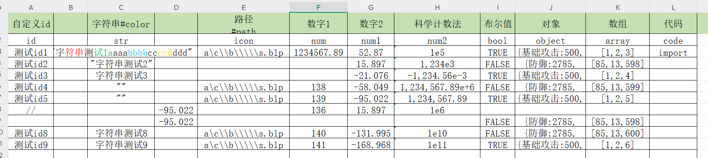

# War3ExcelTool 🛠️

## 项目简介

War3ExcelTool 是批量处理表格的工具，可以用在 war3 作图，能够将 Excel 表格数据批量转换为 typescript、lua、ini 、json 文件，也能够将物编 ini 文件转换为 Excel 文件。

## 仓库地址

[gitee 下载地址]()
[github 下载地址]()

## 下载

下载 release 的压缩包

## 功能详解 🧠

### **批量处理**

支持批量处理多个 Excel 文件，支持以下格式：`.xls, .xlsx, .xlsm, .xlsb, .odf, .ods, .odt`

---

### **Excel 文件解析功能**

1. excel 表格第一行为注释行，不写入生成的文件中；第二行是 key 值，作为生成对象的键，第三行开始是数据行
2. key 值为空的列不解析；id 为空或以//开头的行不解析，默认注释行
   
3. 自动识别单元格数据类型，ts 识别成 number、string、boolean、any
4. 支持字符级颜色识别，需注意：有颜色识别的列要加上预处理指令(#color)
   
5. 不正确的 war3 路径格式自动修改 `如：a\c\\b\\\\\s.blp 修改为 a\\c\\b\\s.blp`
6. 支持科学计数法 `1,234,567.89e+6`，可以用英文逗号','
7. 支持对象、数组、布尔值、数字、字符串，布尔值大写小写都行(true/false)
8. 预处理指令

- (#color) 颜色识别
- (#default bbb) 设置默认值，该列空的单元格的值设置为 bbb
  
  `"default": "bbb",`

---

### **白泽框架说明**

- 白泽框架物编表格：名为 table 的 excel 文件，sheet 名为 `unit、 ability、item`表格

  - **unit**

    单位 id：`h004`开始，依次递增
    注意：`acquire=0`时，物编会写入 `weapsOn=0`，即单位不能攻击
    

  - **ability**

  X/Y/Z+玩家序号+技能按钮 x 坐标+技能按钮 y 坐标
  id 第 1 位：无目标为 X，单位目标为 Y，点目标为 Z
  id 第 2 位：玩家序号：p
  id 第 3 位：技能按钮位置 x 坐标：x:0-3，4 列
  id 第 4 位：技能按钮位置 y 坐标：y:0-2，3 行
  id=X/Y/Z+p+x+y

  - **item**

  物品 id：`I004`开始，依次递增
  物品技能 id：`A004`开始，依次递增

- 生成名字与物编 id 双向映射的 ts 文件，例如：

  ```ts
  export const UnitId = {
    test: "h006",
    h006: "test",
    冰雪法师: "h008",
    h008: "冰雪法师",
    剑圣: "h007",
    h007: "剑圣",
    助手: "h004",
    h004: "助手",
    单位: "h005",
    h005: "单位",
  } as const;
  ```

### **Excel 转 ts**

code 列可以写代码，import 放在 ts 文件最前面，其他放在 Start 函数内

### **Excel 转 lua**

### **Excel 转 json**

---

### **Excel 转 ini**

- **物編 ID 冲突检测**
  War3 物編 ID 不能重复，若有重复会自动检测并生成"物编 ID 冲突报告"
- **物编表格**
  只有被识别成物编表格的 excel 文件的 sheet 才会生成 ini 文件，识别规则：

  1. 白泽框架物编表格中的 unit,ability,item 表格
     
  2. 通用物编表格：excel 文件名无要求，sheet 名第二行 key 值包括 `id和_parent`的表格
     
  3. 如果物编 id 重复使用，会详细指出哪个 excel 文件，哪个 sheet，哪一行重复了

- **war3ini 格式**
  需要注意 war3ini 的格式：`{1,2,3}`：中括号内用逗号间隔：表示多个等级的数据，`[=[...]=]`：以 `[=[`开头，以 `]=]`结尾表示多行字符串

---

### 配置管理 ⚙️

配置文件格式为 `.cfg`，包含以下配置项：

- **路径参数**

  - `input_path` ：输入路径，Excel 文件所在目录
  - `output_path` ：基础输出目录，所有转换结果的基础输出目录
  - `ini_output` ：INI 文件路径，生成的 INI 文件额外复制到此路径下
  - `w3x2lni_path` ：w3x2lni 工具路径，开启 w3x 解析功能时必须配置

- **功能参数**

  - `convert_to_ts` ：是否开启 Excel 到 TypeScript 转换
  - `convert_to_lua` ：是否开启 Excel 到 Lua 转换
  - `convert_to_json` ：是否开启 Excel 到 JSON 转换
  - `convert_to_ini` ：是否开启 Excel 到 INI 转换
  - `convert_ini_to_excel` ：是否开启 INI 到 Excel 转换
  - `parse_w3x` ：是否开启 w3x 解析功能

- **辅助参数**

  - `baize_frame` ：是否启用白泽框架，默认：True
  - `player_count` ：玩家数量，影响基础技能物编数量，默认：5
  - `recursive` ：是否递归处理输入目录，默认：True
  - `log_level` ：日志级别（DEBUG/INFO/WARNING/ERROR/CRITICAL），默认：INFO
  - `sort_by_alpha` ：生成表格是否按字母排序，默认：False
  - `font_size` ：Excel 导出字体大小，默认：14
  - `remove_empty_columns` ：生成 Excel 时删除全空列，默认：True
  - `thread_count` ：处理 Excel 文件的线程数，0 表示自动(CPU 核心数+4)，默认：0
  - `use_excel_cache` ：是否启用 Excel 解析缓存，提高重复处理效率，默认：True
  - `enable_color_recognition` ：是否启用 Excel 单元格颜色识别功能，默认：False

### 命令行参数

- `-i, --input`：输入目录或文件，必须设置
- `-o, --output`：输出目录，必须设置
- `--ini-output`： ini 文件路径（可不设置）

## 特别提醒

1. 开启字符级颜色识别功能会导致转化过程变慢，因为是读取 excel 文件内每个字符的格式

## 功能演示



```ts
export const xlsx_inte_keys_test_Sheet1 = [
  "id",
  "str",
  "icon",
  "num",
  "num1",
  "num2",
  "bool",
  "object",
  "array",
];

export interface xlsx_inte_test_Sheet1 {
  [key: string]: {
    id?: string; // 自定义id
    str?: string; // 字符串
    icon?: number | string; // 路径
    num?: number; // 数字1
    num1?: number; // 数字2
    num2?: number; // 科学计数法
    bool?: boolean; // 布尔值
    object?: any; // 对象
    array?: any; // 数组
  };
}

export const xlsx_data_test_Sheet1: xlsx_inte_test_Sheet1 = {
  测试id4: {
    id: "测试id4",
    str: "字|cffff0000符串|r测|cff00b050试1a|raaa|cff00b0f0bbbb|rcc|cffffc000ccd|rddd",
    icon: "a\\c\\b\\s.blp",
    num: 138,
    num1: -58.049,
    num2: 1234567.89e6,
    bool: false,
    object: { 防御: 2785, 法抗: 58118 },
    array: [85, 13, 599],
  },
};
export class xlsx_test_Sheet1 {
  static Start() {
    const data = xlsx_data_test_Sheet1;
    for (let datum of data) {
      if (datum.id) {
        ActorTypeUtil.registerActorType(datum as any);
      }
    }
  }
}
```

## 安装项目所需要 python 包

1. Windows 用户:

- 运行 setup.bat
- 如果检测到 Anaconda 环境，会自动激活 base 环境
- 脚本会启动 install_dependencies.py，提供交互式菜单选择创建环境或安装依赖

2. 命令行:

- 直接使用命令行参数:
- python install_dependencies.py --create-env 创建新的 conda 环境
- python install_dependencies.py --install-deps 在当前环境中安装依赖

## 模式介绍 🚀

- **命令行模式**
  配置 vscode 任务：

  ```json
  {
    "version": "2.0.0",
    "tasks": [
      {
        "label": "运行 main(命令行模式)",
        "type": "shell",
        "command": "python",
        "args": [
          "src/main.py",
          "-i",
          "else/Test/input", // 统一使用正斜杠避免转义问题
          "-o",
          "else/Test", // 含空格路径必须用双引号包裹
          "--ini-output", //ini文件路径
          "else/Test/initest"
        ],
        "options": {
          "cwd": "${workspaceFolder}"
        },
        "problemMatcher": [],
        "group": {
          "kind": "build",
          "isDefault": true
        }
      }
    ]
  }
  ```

- **GUI 模式**

  运行程序后，会弹出 GUI 界面，选择需要的功能，点击转换按钮即可。

---

## 打包为可执行文件

打包运行 build.py 即可，也可以新建一个 task 一键打包（执行 python build.py）
